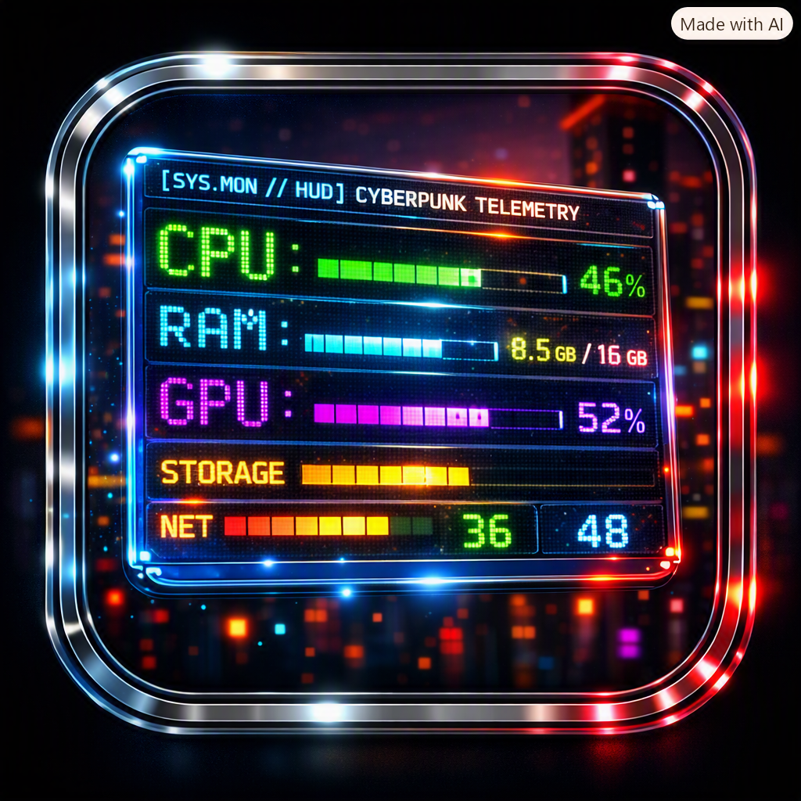

# 📊 CyberpunkSystemMonitor

<div align="center">



<h3>A futuristic, data-dense cyberpunk telemetry HUD widget for Windows desktop.</h3>

[](https://dotnet.microsoft.com/)
[](https://learn.microsoft.com/en-us/dotnet/desktop/wpf/)
[](https://www.microsoft.com/windows)
[](publish/)
[](https://learn.microsoft.com/en-us/windows/)
[](LICENSE)

</div>

---

## ⚡ Overview

**CyberpunkSystemMonitor** is a sleek, ultra-responsive telemetry HUD desktop widget crafted in C# and WPF (.NET 8). Built with the shared design language and visual aesthetic of **`CyberClockWidget`**, **`CyberPunkNoteWidget`**, **`CyberpunkSlideshowWidget`**, and **`CyberpunkTerminalWidget`**, it gives power users a high-density, real-time command center for monitoring Windows hardware and system telemetry.

Featuring acrylic dark glass panels, vector 5x7 and 3x5 LED dot-matrix digital readouts, multi-color threshold neon segmented meters, pulsing round disk I/O activity diodes, and an authentic retro CRT effects suite, **CyberpunkSystemMonitor** turns your desktop into a futuristic Cyberpunk terminal.

---

## ✨ Key Features & Telemetry Modules

```
 ┌────────────────────────────────────────────────────────────────────────┐
 │ [SYS.MON // HUD] CYBERPUNK TELEMETRY • CPU: 24.5%   ⟳ REFRESH 📌 TOP 🗕 ✕│
 ├────────────────────────────────────────────────────────────────────────┤
 │ [01] CPU PROCESSOR                  AMD Ryzen 9 5900X 12-Core Processor│
 │ [ CPU: 24.5% ]  TOTAL CPU LOAD: 24.5% [██████████░░░░░░░░░░░░░░░░░░░░] │
 │ Cores: 12P / 24T           Procs: 284                    Threads: 3,920│
 │ LOGICAL CORES UTILIZATION MATRIX:                                      │
 │ [C00: 22%] [C01: 45%] [C02: 12%] [C03: 88%] [C04: 15%] [C05: 30%] ... │
 ├────────────────────────────────────────────────────────────────────────┤
 │ [02] SYSTEM MEMORY (RAM)                  Used: 15.4 GB / Total: 31.6 GB│
 │ [ RAM: 48.7% ]  PHYSICAL RAM IN USE: 48.7% [██████████████░░░░░░░░░░░] │
 │ Available: 16.2 GB Free                       Commit: 21.4 GB / 36.5 GB│
 ├────────────────────────────────────────────────────────────────────────┤
 │ [03] GRAPHICS PROCESSOR (GPU)                 NVIDIA GeForce RTX 4080  │
 │ [ GPU: 32.0% ]  3D CORE ENGINE LOAD: 32.0% [█████████░░░░░░░░░░░░░░░░] │
 │ VIDEO MEMORY (VRAM): 4.2 GB / 16.0 GB (26%)  [███████░░░░░░░░░░░░░░░░] │
 ├────────────────────────────────────────────────────────────────────────┤
 │ [04] STORAGE VOLUMES & REAL-TIME I/O             ACTIVE DISK MONITORS  │
 │ [C:] SYSTEM (NVMe • NTFS)                     412.5 GB / 931.5 GB (44%)│
 │ [●] READ: 14.2 MB/s     [●] WRITE: 2.1 MB/s             FREE: 519.0 GB │
 ├────────────────────────────────────────────────────────────────────────┤
 │ [05] NETWORK INTERFACE                                IP: 192.168.1.145│
 │ Intel(R) Ethernet Controller I225-V [Ethernet]                         │
 │ [↓ 4.8 MB/s] DOWNLOAD (RX)               [↑ 320 KB/s] UPLOAD (TX)      │
 │ Packets Recv: 1,420,890 (2.4 GB)      Packets Sent: 980,120 (410.2 MB) │
 ├────────────────────────────────────────────────────────────────────────┤
 │ [06] TOP RUNNING PROCESSES                           [MEM ▼]  [CPU]    │
 │ PID     PROCESS NAME             MEMORY          CPU %          THREADS│
 │ 14208   chrome.exe             1,420.5 MB         3.2%               48│
 │ 9820    Code.exe                 890.2 MB         1.8%               36│
 │ 4210    Cyberpunk2077.exe      4,820.0 MB        18.5%               64│
 ├────────────────────────────────────────────────────────────────────────┤
 │ [●] UPTIME: 3d 14:22:10   POLLING: 1000ms      [R-CLICK FOR HUD CONFIG]│
 └────────────────────────────────────────────────────────────────────────┘
```

### 🖥️ 1. CPU Processor Unit & Logical Cores Matrix
- **Total Utilization**: Vector 5x7 LED dot-matrix digital readout + neon segmented bar meter.
- **Logical Cores Matrix**: Real-time 4-column grid displaying individual load bars for all physical and logical CPU cores (Core 00 to Core 31+).
- **Hardware Insights**: Hardware processor identifier from Registry, physical/logical thread counts, active system processes, thread count, handle count, and uptime.

### 🧠 2. System Memory (RAM) & Commit Charge
- **Physical RAM Load**: Real-time utilization percentage LED readout and high-density segmented meter.
- **Memory Breakdown**: Used physical RAM (GB), Available/Free physical RAM (GB), and Total installed RAM (GB) sampled instantaneously via native `GlobalMemoryStatusEx` API.
- **Commit Charge**: Live commit pagefile tracking with used vs total commit limits.

### 🎮 3. Graphics Processor (GPU) & Video Memory
- **3D Core Engine Load**: Real-time GPU 3D utilization percentage and meter.
- **Dedicated Video Memory (VRAM)**: Live dedicated VRAM consumption (GB used vs total capacity) and segmented load meter.
- **Hardware Detection**: Automatic identification of discrete/integrated GPU adapters via WMI and Windows Performance Counters.

### 💾 4. Storage Volumes & Real-Time I/O Activity
- **Volume Metrics**: Drive letters, volume labels, format types, total capacity, used space, and free space meters.
- **Live I/O Diode Indicators**: Real-time pulsing round LED indicators (`RoundLedIndicator`) for **READ** (Neon Green/Cyan) and **WRITE** (Pink/Amber) activity per drive with live data transfer speed readouts (KB/s and MB/s).

### 🌐 5. Network Interface & Throughput
- **Active Adapter**: Adapter name, interface type (Ethernet / Wi-Fi), and local IPv4 address badge.
- **Dual Vector LED Speedometers**: Live Download (Rx) and Upload (Tx) speeds rendered with glowing dot-matrix readouts.
- **Network Counters**: Total packets received/sent and cumulative bandwidth transferred.

### ⚡ 6. Top Running Processes
- **Process Telemetry Table**: Real-time listing of top system processes with PID, Name, RAM consumption (MB/GB), CPU load (%), and thread counts.
- **Interactive Sorting**: One-click toggling between **Sort by Memory (RAM)** and **Sort by CPU Usage**.

### 🎨 7. Retro Cyberpunk Visual FX Suite & Customization
- **Vector LED Font Engine**: Procedural 5x7 and 3x5 matrix character rendering with configurable bloom glow, diode specular lighting, and unlit ring chassis.
- **Retro CRT Effects**:
  - *Scanlines Overlay*: Configurable line thickness and density.
  - *CRT Glitch & Jitter*: Procedural chromatic tear bars and micro displacement.
  - *CRT Snow Static*: Multi-frame procedural analog TV static grain.
  - *Cyberpunk Rainbow Border*: Rotating animated spectrum gradient with ambient glow.
- **Customization Suite**:
  - Acrylic window glass opacity slider (30% – 100%).
  - Theme window background tints (*Deep Cyan*, *Dark Onyx*, *Midnight Purple*, *Matrix Charcoal*).
  - Multi-palette HUD accent colors (*Electric Cyan*, *Matrix Green*, *Solar Amber*, *Synthwave Magenta*, *Night City Violet*, *Glitch Red*, *Phosphor White*, or *Custom Hex*).
  - Smooth RGB Spectrum Cycling with speed adjustment.
  - System font picker dialog with live preview (`FontPickerWindow.xaml`).
  - Polling rate selector (500ms, 1000ms, 2000ms, 5000ms).
  - Session persistence: window position, dimensions, and preferences automatically saved to `%APPDATA%\CyberpunkSystemMonitor\settings.json`.

---

## 🎛️ Context Menu & HUD Controls

Right-click anywhere on the monitor widget to open the configuration HUD:

| Menu Option | Description |
| :--- | :--- |
| **Telemetry Polling Rate** | Set sampling frequency: Fast (500 ms), Normal (1000 ms), Relaxed (2000 ms), or Eco (5000 ms). |
| **Top Processes Count** | Adjust process table limit: Top 5, Top 8, Top 12, Top 16, or Top 24. |
| **Process Sorting** | Switch between Sort by Memory (RAM) and Sort by CPU Usage. |
| **HUD Accent Color** | Choose cyberpunk presets (Electric Cyan, Matrix Green, Solar Amber, Synthwave Magenta, Night City Violet, Glitch Red, Phosphor White) or custom hex code. |
| **RGB Spectrum Cycling** | Toggle continuous 360° rainbow hue cycling across the HUD. |
| **RGB Cycle Speed** | Adjust spectrum rotation speed (0.2x to 3.0x). |
| **Window Glass Opacity** | Adjust acrylic transparency (30% to 100%). |
| **Window Tint** | Choose dark background tint: Deep Cyan, Dark Onyx, Midnight Purple, or Matrix Charcoal. |
| **Visual FX > LED Matrix Bloom Glow** | Toggle glowing halo bloom around LED digits and meters. |
| **Visual FX > Cyberpunk Rainbow Border** | Toggle rotating neon RGB border with width slider (1px–10px). |
| **Visual FX > Retro CRT Scanlines** | Toggle vintage CRT scanlines with density slider (2px–10px). |
| **Visual FX > CRT Glitch & Jitter** | Toggle retro CRT sync jitter and chromatic tears with intensity slider (1%–100%). |
| **Visual FX > CRT Static Snow Noise** | Toggle continuous TV snow static with strength slider (5%–100%). |
| **Always on Top** | Pin widget above all desktop applications and games. |
| **HUD Font Settings...** | Open System Font Picker dialog to select installed Windows fonts and sizes. |
| **Reset Window Position** | Re-center widget on the primary display. |
| **Exit Monitor** | Cleanly terminate all background workers, counters, and timers with zero lingering footprint. |

---

## ⌨️ Header Bar Actions & Gestures

- **`⟳ REFRESH` Button:** Instantly triggers an out-of-band telemetry snapshot.
- **`📌 TOP` Button:** Quick toggle for Always On Top window pinning.
- **`🗕` Button:** Minimize widget to taskbar (stops sampling and GPU rendering while minimized to save CPU).
- **`✕` Button:** Exit application with clean memory teardown.
- **`MEM ▼` / `CPU ▼` Buttons:** Click directly on the process table header to toggle sorting mode.
- **Left-Click & Drag:** Drag from the header or any panel background to move the HUD anywhere across multiple monitors.
- **Corner Resize:** Drag the bottom-right grip to resize the window dynamically.
- **Mouse Wheel on Sliders:** Hover over any slider in the Context Menu and scroll to adjust values incrementally.

---

## 🚀 Performance & Architecture

- **Low-Overhead Native Telemetry**: Uses `GlobalMemoryStatusEx` via `kernel32.dll` for sub-millisecond RAM sampling and Registry lookups for zero-cost CPU metadata retrieval.
- **Single-Pass Process Enumeration**: CPU utilization, thread counts, handle totals, and top-N memory consumers are collected in a single pass, eliminating duplicate process queries and reducing GC allocations by >50%.
- **Non-Blocking Dispatcher Pipeline**: All metrics sampling executes asynchronously inside background workers (`Task.Run`), ensuring the WPF UI thread maintains silky-smooth 60+ FPS animation frames with 0 stutter.
- **Zero-Footprint Clean Teardown**: Explicitly disposes all `PerformanceCounter` instances, stops all timers, drains pending finalizers, and invokes `App.CleanProcessExit(0)` to ensure zero lingering background COM, WMI, or DirectX worker threads remain in Windows Task Manager upon exit.

---

## 🛠️ Building and Running

### Prerequisites
- Windows 10 (Build 1809+) or Windows 11
- [.NET 8.0 SDK](https://dotnet.microsoft.com/download/dotnet/8.0) or higher

### Compiling & Running
```powershell
cd "D:\Other Coding Projects\CyberpunkSystemMonitor"

# Build debug executable
dotnet build

# Run application
dotnet run

# Build release executable
dotnet build -c Release

# Publish standalone single-file binary
dotnet publish -c Release -r win-x64 --self-contained false -p:PublishSingleFile=true -o ./publish
```

---

## 📄 License

This project is licensed under the [MIT License](LICENSE).

